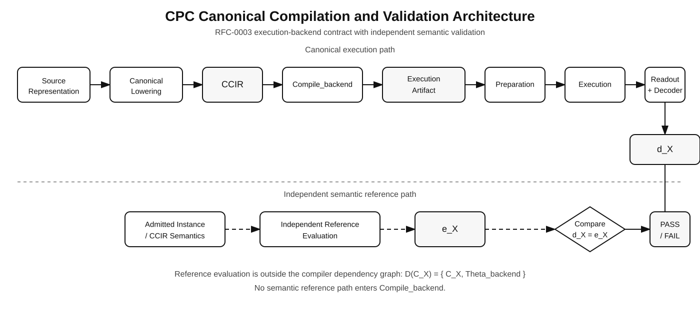
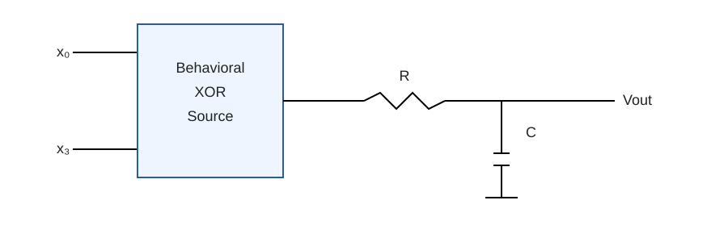

# CPC Reference Validation Framework

**Reference implementation of the Constraint Physical Computing (CPC) architecture**

[](LICENSE)
[](https://www.python.org/)
[](https://ngspice.sourceforge.io/)
[](#development-status)

---

## Constraint Physical Computing

**Constraint Physical Computing (CPC)** is the umbrella architecture. This
repository is its **reference validation framework**, while individual
execution backends are concrete realizations of the common CPC compilation and
validation contracts.

Constraint Physical Computing (CPC) is a backend-independent computational
architecture in which constraint systems are transformed into a canonical
intermediate representation and compiled into execution artifacts suitable for
physical or simulated computational substrates.

Unlike architectures tied to a specific computational medium, CPC separates the
logical description of a problem from its physical realization. Constraint
representation, execution-backend compilation, preparation, execution,
interface readout, semantic decoding, and independent validation are treated
as distinct architectural layers with precisely defined interfaces.

This separation permits multiple computational substrates to implement the same
canonical constraint representation while remaining interchangeable at the
architectural level.

---

## Purpose of this Repository

This repository contains the reference implementation of the CPC Reference
Validation Framework.

Its purpose is not to define a particular physical implementation of CPC.
Instead, it establishes the architectural contracts that every CPC execution backend
must satisfy.

These include

- Canonical Constraint Intermediate Representation (CCIR);
- execution-backend compilation contracts;
- execution artifact definitions;
- machine-checkable provenance;
- answer-independence requirements;
- execution-backend validation procedures;
- semantic validation procedures;
- the RC Reference Backend;
- the deterministic Digital Backend; and
- the FPGA Execution Backend.

The RC Reference Backend serves as the reference realization of the physical
execution lifecycle, while the Digital and FPGA backends provide structurally
distinct realizations of the same canonical CPC contracts. Additional
implementations may target different computational substrates while preserving
the same canonical interfaces.

---

## Quick Start

Clone the repository and create an isolated Python environment:

```bash
git clone https://github.com/GridSAT/cpc-validation.git
cd cpc-validation

python3 -m venv .venv
source .venv/bin/activate

python -m pip install --upgrade pip
python -m pip install -r requirements.txt
```

Run the complete regression suite:

```text
python -m pytest -q
```

Run the built-in RC/ngspice verification:

```text
python run_spice.py
```

For exact environment reproduction, use requirements-lock.txt.

---

## Cross-Backend Demonstration

CPC backend independence can be exercised directly by compiling and executing
the same canonical CCIR program through two structurally distinct execution
backends.

Run:

    python validate_cross_backend.py \
      benchmarks/default_xor.json \
      --boundary 0=0 \
      --boundary 3=1

The reference comparison executes the same canonical constraint program through

- the RC Reference Backend using ngspice; and
- the deterministic Digital Backend using an independent digital instruction
  execution path.

Both backends consume the same CCIR program, but they produce different
backend-specific ExecutionArtifacts, use different preparation procedures,
execute through different engines, expose different admitted observations, and
apply their own fixed decoders.

The resulting decoded values are compared only after both backend executions
have completed.

Independent canonical continuation semantics are then evaluated outside both
backend dependency graphs.

A successful run reports:

    RC Reference Backend
      backend:            rc/1
      execution engine:   ngspice
      decoded result:     1

    Digital Backend
      backend:            digital/1
      execution engine:   python-digital-interpreter
      decoded result:     1

    Independent Reference
      semantic result:    1

    Backend agreement:    PASS
    RC semantic match:    PASS
    Digital semantic:     PASS

    OVERALL:              PASS

Backend agreement and semantic correctness are deliberately separate
conditions.

Agreement between two backends is not treated as evidence of correctness
unless each decoded result also agrees independently with canonical CCIR
semantics.

This provides an executable demonstration of CPC backend interchangeability:
one canonical representation is realized through heterogeneous execution
technologies while remaining subject to one independent validation
architecture.

### Cross-Backend Benchmark Corpus

RFC-0006 extends the single-case RFC-0005 comparison to deterministic benchmark
corpora with exhaustive finite boundary enumeration.

Run:

    python validate_cross_backend_benchmarks.py benchmarks/

The current accepted corpus discovers 16 benchmarks and executes 64 boundary
cases across the RC and deterministic Digital backends.

The accepted RFC-0006 validation result is:

    Benchmarks:             16
    Boundary cases:         64

    Backend agreement:      64/64 PASS
    RC semantic match:      64/64 PASS
    Digital semantic match: 64/64 PASS

    OVERALL:                PASS

The command writes machine-readable evidence to:

    results/cross_backend_validation.csv
    results/cross_backend_summary.json

The JSON summary uses schema:

    cpc.cross-backend-summary.v1

These results constitute finite validation evidence for the executed corpus.
They do not establish universal correctness for arbitrary programs, arbitrary
backends, or unexecuted instances.

---

## Architectural Philosophy

The central principle of CPC is the separation of **representation** from
**realization**.

Applications interact only with canonical constraint representations.
Execution backends determine how those representations are transformed into executable
artifacts.

Consequently,

```
Constraint System
        ↓
      CCIR
        ↓
Compile_backend
        ↓
ExecutionArtifact
```

defines the architectural boundary of CPC.

Everything below this boundary belongs to the execution-backend implementation.

Everything above this boundary is backend-independent.

This distinction allows new computational substrates to be introduced without
changing the logical interface presented to applications.

---

## Current Status

The CPC Reference Validation Framework currently provides:

- complete CCIR infrastructure;
- RFC-0003 execution-backend compilation contract;
- RFC-0004 physical execution backend engineering and conformance;
- RFC-0005 cross-backend equivalence and independent validation;
- RFC-0006 cross-backend benchmark validation and reproducibility;
- RFC-0007 backend qualification and conformance manifests;
- RFC-0008 FPGA execution backend and tri-backend validation;
- RFC-0009 physical execution evidence and substrate conformance;
- RFC-0010 driven-dissipative open-system execution and referenced-readout architecture;
- ExecutionArtifact contract;
- first-class PreparedExecution state;
- first-class ObservableExecution result;
- fixed backend decoding;
- independent post-execution physical validation;
- machine-checkable provenance through execution;
- execution-environment reproducibility metadata;
- compiler validation;
- semantic validation;
- restricted-interface validation;
- Answer Independence validation;
- RC Reference Backend;
- deterministic Digital Backend;
- FPGA Execution Backend;
- tri-backend semantic validation;
- FPGA backend qualification;
- physical execution evidence and substrate conformance;
- comprehensive automated regression suite.

These components, together with the RFC-0010 execution-specification model,
conformance validation, and reference witness, establish the current reference
implementation of the combined RFC-0001 through RFC-0010 CPC architecture.

RFC-0010 extends the architecture for driven-dissipative open-system execution
and referenced readout.  Its current repository realization is a software
specification, conformance layer, and reference witness.  It is not evidence
that a superconducting, bosonic, or other driven-dissipative open-system
substrate has been physically implemented or executed.

---

## Canonical Architecture

The CPC architecture is organized as a sequence of strictly separated
responsibility layers.

```text
                 Application
                      │
                      ▼
             Source Representation
                      │
                      ▼
        Canonical Constraint Lowering
                      │
                      ▼
                     CCIR
                      │
                      ▼
     Compile_backend : CCIR → ExecutionArtifact
                      │
                      ▼
              ExecutionArtifact
        (Topology, Parameters,
       Interface, Metadata,
           Provenance)
                      │
                      ▼
                 Preparation
                      │
                      ▼
              PreparedExecution
                      │
                      ▼
                  Execution
                      │
                      ▼
             ObservableExecution
                      │
                      ▼
               Fixed Decoder
                      │
                      ▼
               Decoded Result
                      │
        =========================
          Backend boundary ends
        =========================
                      │
                      ▼
          Independent Validation
                      │
                      ▼
                 PASS / FAIL
```

<p align="center">
  
</p>

Each layer has a precisely defined responsibility.

The architectural objective is that adjacent layers communicate only through
well-defined interfaces. No layer may depend upon implementation details that
belong to another layer.

This separation enables independent evolution of frontend representations,
execution-backend implementations, execution substrates, and validation procedures.

---

## Three-Layer View

The same architecture can be summarized as three responsibility domains:

```text
Frontend
    source representation
    canonical lowering
    CCIR
         │
         ▼
==============================
Canonical execution boundary
==============================
         │
         ▼
Execution Backend
    compilation
    ExecutionArtifact
    preparation
    PreparedExecution
    execution
    ObservableExecution
    fixed decoder
    decoded result
         │
         ▼
==============================
Backend boundary ends
==============================
         │
         ▼
Validation
    compiler conformance
    independent semantic evaluation
    post-execution comparison
    PASS / FAIL
```
    
The frontend determines the canonical constraint program. The execution
backend determines how that program is realized. The validation layer
independently establishes compiler conformance and semantic correctness.    
    
---

## Layer Responsibilities

### Source Representation

Applications are free to describe computational problems using any supported
representation.

Examples include Boolean satisfiability, parity systems, graph constraints,
finite-domain constraint systems, scheduling formulations, or future source
languages.

Source languages are **frontend concerns** only.

Backends never operate directly on source-language representations.

---

### Canonical Constraint Intermediate Representation (CCIR)

CCIR is the canonical architectural interface of CPC.

Every admitted frontend lowers its source representation into CCIR before any
backend-specific processing occurs.

Consequently, all execution-backend implementations receive identical canonical
input independent of the original source language.

CCIR therefore defines the stable boundary between frontend and backend.

---

### Execution-Backend Compilation

Execution-backend compilation transforms CCIR into an executable realization suitable
for a specific computational substrate.

RFC-0003 defines this transformation abstractly as

```text
Compile_backend : CCIR → ExecutionArtifact
```

The backend contract specifies *what* compilation must produce rather than
*how* it is internally implemented.

Different backends may employ entirely different compilation strategies while
remaining conformant to the same architectural contract.

---

### Execution Artifact

Compilation produces an **ExecutionArtifact**.

Conceptually,

```text
ExecutionArtifact

├── Topology
├── Parameters
├── Interface
├── Metadata
└── Provenance
```

The artifact contains the complete backend-specific description required by
the execution contract.

RFC-0003 intentionally treats the artifact abstractly.

For the RC Reference Backend, the topology contains an electrical circuit
structure.

For a digital backend it may contain logic structures.

For an FPGA execution backend it may contain configuration data.

For another physical substrate it may contain an entirely different execution
representation.

The architecture requires only that every backend expose the canonical
ExecutionArtifact interface.

---

### Preparation

Preparation transforms an ExecutionArtifact into an executable state for the selected
execution substrate.

Examples include

- generating an ngspice netlist;
- configuring FPGA resources;
- loading digital hardware;
- initializing analog systems;
- preparing coherent physical media.

Preparation belongs entirely to the backend implementation.

It is not part of CCIR.

---

### Execution

Execution is performed by the computational substrate.

The CPC architecture intentionally does not prescribe execution dynamics.

Execution may be

- numerical,
- digital,
- analog,
- physical,
- hybrid,
- deterministic,
- stochastic,

provided that execution operates exclusively upon the compiled
ExecutionArtifact.

---

### Interface Readout

Execution results become observable only through an admitted interface.

Each backend specifies

- observable quantities,
- readout channels,
- interface metadata,

together with the information required by the fixed decoder.

No semantic interpretation occurs during readout.

Readout merely exposes admissible observations.

---

### Fixed Decoder

The fixed decoder transforms admitted observations into backend outputs.

The decoder forms part of the backend specification.

It is fixed independently of any particular execution.

Because every backend defines its own interface, every backend also defines its
own decoder.

RFC-0003 requires semantic validation to operate exclusively on decoder output.

---

### Independent Validation

Validation is architecturally separated from compilation.

Reference evaluators are never compiler components.

Instead,

1. compilation produces an ExecutionArtifact;
2. execution produces interface observations;
3. decoding produces backend outputs;
4. independent validation compares those outputs against external semantic
   reference procedures.

This separation ensures that semantic correctness is established independently
of backend compilation.

It also provides the architectural foundation for the Answer Independence
principle formalized in RFC-0003.

---

## Canonical Constraint Intermediate Representation (CCIR)

The Canonical Constraint Intermediate Representation (CCIR) is the stable
architectural interface between CPC frontends and execution-backend implementations.

Every admitted source representation is lowered into CCIR before backend
compilation begins. Execution-backend implementations therefore never operate directly
on source-language representations.

```text
Application

      │

Source Language
(DIMACS, parity systems,
graph constraints, ...)

      │
      ▼

Canonical Lowering

      │
      ▼

     CCIR

      │
      ▼

Compile_backend
```

CCIR deliberately separates **problem representation** from **execution
strategy**.

A backend receives only canonical constraint information together with the
admitted interface specification. It does not receive information about the
original source language, parser, benchmark format, or frontend implementation.

Consequently,

- DIMACS is not part of the backend architecture.
- Parity systems are not part of the backend architecture.
- CNF encodings are not part of the backend architecture.
- Graph formulations are not part of the backend architecture.

These are frontend concerns only.

CCIR defines the unique canonical representation consumed by every backend.

---

### Architectural Role

CCIR exists to ensure that backend implementations remain independent of
source-language decisions.

Without CCIR, every backend would require direct support for every frontend
representation.

Instead,

```text
Frontend A ─┐
Frontend B ─┼────► CCIR ─────► Backend
Frontend C ─┘
```

The frontend/backend interface therefore scales independently.

Adding a new frontend does not require modifying existing backends.

Adding a new backend does not require modifying existing frontends.

This separation is one of the primary architectural objectives of CPC.

---

### Canonical Program Structure

A CCIR program consists of four conceptual components.

```text
CCIR Program

├── Variables
├── Constraints
├── Boundary Interface
└── Metadata
```

---

### Variables

Variables define the canonical state space manipulated by the backend.

Variables possess no backend-specific interpretation.

They are logical identifiers only.

---

### Constraints

Constraints describe admissible relationships among variables.

Constraint families are represented canonically.

Examples include

- parity constraints,
- clause constraints,
- future constraint families admitted by the CCIR specification.

Backends operate on canonical constraint families rather than on
source-language syntax.

---

### Boundary Interface

The boundary interface specifies the externally admitted interaction between
the execution artifact and its environment.

Typical interface information includes

- boundary variables,
- externally supplied values,
- observable outputs,
- decoder inputs.

The interface forms part of the canonical program.

It is therefore available to every backend independently of execution
technology.

---

### Metadata

Metadata records canonical descriptive information that accompanies the CCIR
program.

Metadata may include

- program identifiers,
- version information,
- frontend provenance,
- descriptive annotations.

Metadata does not alter program semantics.

---

### Canonical Lowering

Every frontend is responsible for producing valid CCIR.

Canonical lowering is the only location where source-language semantics are
interpreted.

After lowering,

```text
Source Representation
        │
        ▼
Canonical Lowering
        │
        ▼
      CCIR
```

all subsequent processing operates exclusively on CCIR.

This architectural rule guarantees that backend behavior is independent of the
particular frontend used to construct the canonical program.

---

### Architectural Independence

RFC-0002 establishes CCIR as the canonical boundary between frontend and
backend.

RFC-0003 extends this principle by requiring backend compilation to consume
only CCIR together with the globally fixed backend specification.

Consequently,

```text
Compile_backend : CCIR → ExecutionArtifact
```

is the only architectural contract required of backend implementations.

Every conforming backend therefore receives identical canonical input,
regardless of the original application or source-language representation.

This property enables backend interchangeability while preserving a stable,
backend-independent frontend architecture.

---

## Execution-Backend Compilation Contract

RFC-0003 defines the canonical interface implemented by every CPC backend.

Unlike backend-specific implementations, the compilation contract is entirely
independent of execution technology.

The contract specifies only the architectural transformation that every backend
must realize.

```text
Compile_backend : CCIR → ExecutionArtifact
```

The compilation contract defines the unique boundary between canonical
constraint representation and backend realization.

Everything above this boundary belongs to the frontend architecture.

Everything below this boundary belongs to the backend implementation.

---

### Architectural Responsibility

Backend compilation transforms a canonical CCIR program into an executable
artifact suitable for a particular computational substrate.

The contract intentionally does **not** prescribe

- execution dynamics;
- numerical methods;
- circuit realization;
- physical implementation;
- hardware architecture; or
- simulation technology.

These are backend-specific design decisions.

RFC-0003 specifies only the observable architectural behavior of backend
compilation.

---

### Execution-Backend Independence

The backend contract is identical for every implementation.

```text
                 CCIR
                   │
                   ▼
          Compile_backend
                   │
                   ▼
           ExecutionArtifact
```

Different implementations may produce entirely different execution artifacts.

For example,

```text
CCIR
 │
 ├────────► RC Reference Backend
 │              │
 │              ▼
 │        RC ExecutionArtifact
 │
 ├────────► FPGA Execution Backend
 │              │
 │              ▼
 │       FPGA ExecutionArtifact
 │
 ├────────► Digital Execution Backend
 │              │
 │              ▼
 │      Logic ExecutionArtifact
 │
 └────────► Future Execution Backend
                │
                ▼
        Backend-specific Artifact
```

Although these artifacts differ internally, they all satisfy the same
architectural contract.

This property permits backend substitution without modifying CCIR or frontend
software.

---

### Compiler Dependency Principle

One of the principal contributions of RFC-0003 is the explicit definition of
compiler dependencies.

Let

```text
Cₓ
```

denote an admitted CCIR program.

Backend compilation is required to satisfy

```text
D(Cₓ) = { Cₓ, Θ_backend }
```

where

- **Cₓ** is the canonical CCIR program; and
- **Θ_backend** is the globally fixed backend specification.

No additional semantic information may participate in compilation.

---

### Backend Specification

Θ_backend represents the globally fixed description of backend behavior.

Typical components include

- compilation rules;
- canonical parameter mappings;
- deterministic construction rules;
- backend constants;
- interface definitions;
- decoder specification;
- provenance rules.

Θ_backend is fixed independently of every compiled program.

Changing Θ_backend defines a different backend specification.

It does **not** modify the semantics of CCIR.

---

### Deterministic Compilation

Backend compilation is deterministic.

Repeated compilation of identical CCIR using the same backend specification
produces equivalent execution artifacts.

Conceptually,

```text
Compile_backend(
    Cₓ,
    Θ_backend
)

↓

ExecutionArtifact
```

is a deterministic architectural transformation.

This property enables

- reproducible builds;
- machine verification;
- backend auditing;
- regression testing; and
- independent validation.

---

### Execution-Backend Capability Declaration

Not every backend supports every CCIR constraint family.

RFC-0003 therefore requires each backend to declare its supported capability
set explicitly.

Conceptually,

```text
Backend Capability

Supported Constraint Families

• parity
• clause
• ...
```

Compilation proceeds only if every constraint family appearing in the input
program is supported by the selected backend.

If a required capability is absent, compilation fails before artifact
generation begins.

Capability declarations therefore provide a stable architectural interface
between CCIR and backend implementations.

---

### Unsupported Programs

A backend is not required to support every admitted CCIR program.

However, unsupported programs must be rejected explicitly.

Compilation must never silently reinterpret, discard, or modify unsupported
canonical information.

Consequently,

```text
Unsupported CCIR

↓

Explicit Compilation Failure
```

is a conforming architectural outcome.

Silent degradation is not.

---

### Backend Extensibility

Because the compilation contract depends only upon CCIR,

```text
Compile_backend : CCIR → ExecutionArtifact
```

new backend implementations may be introduced without modifying

- frontend software;
- canonical lowering;
- CCIR;
- validation architecture; or
- existing backend implementations.

RFC-0003 therefore establishes backend extensibility as an architectural
property rather than an implementation convenience.

This separation allows CPC to evolve by adding new computational substrates
while preserving a stable canonical frontend and validation framework.

---

## ExecutionArtifact

RFC-0003 introduces the concept of the **ExecutionArtifact** as the canonical
result of backend compilation.

Unlike traditional compiler outputs, an ExecutionArtifact is not defined by a
particular implementation technology. It is the complete backend-specific
description required to prepare, execute, observe, and validate a computation
on a chosen computational substrate.

Every conforming backend produces an ExecutionArtifact.

Conceptually,

```text
Compile_backend
        │
        ▼
ExecutionArtifact
```

is the only architectural obligation imposed upon backend implementations.

---

### Canonical Structure

RFC-0003 defines the ExecutionArtifact as

```text
Aₓ = (Tₓ, Pₓ, Iₓ, Mₓ, Πₓ)
```

where

| Component | Description |
|-----------|-------------|
| **Tₓ** | Execution topology |
| **Pₓ** | Backend parameters |
| **Iₓ** | Interface specification |
| **Mₓ** | Backend metadata |
| **Πₓ** | Machine-checkable provenance |

These five components completely describe the executable backend realization.

No additional hidden compiler information is required to define the execution
artifact.

---

### Execution Topology

The topology defines the structural organization of the execution artifact.

Its precise meaning depends upon the backend.

Examples include

- electrical networks,
- digital logic graphs,
- FPGA routing structures,
- dynamical systems,
- optical interconnections,
- coherent physical media,
- future execution substrates.

RFC-0003 intentionally leaves the topology abstract.

Only the architectural role is specified.

---

### Backend Parameters

Parameters instantiate the topology.

Typical examples include

- electrical component values,
- timing constants,
- logical configuration values,
- numerical coefficients,
- calibration constants,
- substrate-specific operating parameters.

Parameters belong entirely to the backend implementation.

They are not represented in CCIR.

---

### Interface Specification

Execution becomes observable only through the admitted interface.

The interface specification defines

- observable quantities,
- readout locations,
- decoding inputs,
- interface metadata,
- externally admitted interaction.

Every backend defines its own interface.

Validation operates exclusively through this interface.

Internal backend state is never interpreted directly.

---

### Backend Metadata

Metadata records descriptive information associated with the execution
artifact.

Examples include

- backend identifier,
- backend version,
- compilation timestamp,
- execution options,
- implementation information.

Metadata facilitates auditing and reproducibility.

It does not modify computational semantics.

---

### Machine-Checkable Provenance

One of the principal contributions of RFC-0003 is the introduction of
machine-checkable provenance.

Every generated artifact element must be traceable to its origin.

Conceptually,

```text
Πₓ :

ArtifactElement

        │

        ▼

CCIROrigin
      or
BackendRuleOrigin
```

No artifact element may exist without provenance.

Opaque descriptions such as

```text
generated_by_compiler
```

are explicitly insufficient.

Instead, provenance must permit an auditor to determine

- which CCIR information produced the element,
- which backend rule generated it,
- and how it entered the final execution artifact.

This enables reproducible backend verification.

---

### Provenance as an Architectural Contract

Provenance is not an implementation detail.

It is part of the backend contract itself.

Consequently,

```text
ExecutionArtifact

├── Topology
├── Parameters
├── Interface
├── Metadata
└── Provenance
```

defines the canonical architectural interface exposed by every backend.

Two implementations using entirely different execution technologies satisfy the
same architectural contract provided that each exposes an admissible
ExecutionArtifact with complete provenance.

---

### Preparation and Execution

The ExecutionArtifact represents a compiled backend-specific computational
description.

Execution itself occurs afterwards.

```text
CCIR
   │
   ▼
Compile_backend
   │
   ▼
ExecutionArtifact
   │
   ▼
Preparation
   │
   ▼
Execution
```

Preparation transforms the artifact into an executable state for the selected
execution substrate.

Execution is then performed by the selected computational substrate.

RFC-0003 intentionally separates these two stages.

This distinction allows identical artifacts to be prepared repeatedly while
keeping compilation independent of execution.

---

### Backend Independence

ExecutionArtifacts produced by different backends need not resemble one
another.

For example,

```text
CCIR

   │

   ├────────► RC Artifact

   ├────────► FPGA Artifact

   ├────────► Digital Artifact

   ├────────► Optical Artifact

   └────────► Future Artifact
```

Each artifact may possess different internal organization.

Nevertheless, each satisfies the same architectural interface

```text
ExecutionArtifact

(T, P, I, M, Π)
```

This common contract permits backend substitution without changing CCIR,
frontend software, or validation procedures.

---

### Architectural Significance

Traditional compilers typically terminate with executable software or hardware
descriptions.

CPC generalizes this concept.

Backend compilation always terminates with an ExecutionArtifact rather than a
technology-specific output format.

The ExecutionArtifact therefore becomes the canonical abstraction connecting

- backend compilation,
- preparation,
- execution,
- interface readout,
- validation.

This abstraction is one of the defining architectural contributions of
RFC-0003 and provides the foundation for backend-independent Constraint
Physical Computing.

---

## Validation Architecture

A defining principle of Constraint Physical Computing (CPC) is the strict
separation between **compilation** and **validation**.

Backend compilation is responsible for constructing an executable realization
of a canonical constraint program.

Validation is responsible for determining whether the observable behavior of
that realization agrees with the semantics of the original problem.

These responsibilities are intentionally independent.

```text
           Execution-Backend Compilation

CCIR
  │
  ▼
Compile_backend
  │
  ▼
ExecutionArtifact

==============================
 Architectural Boundary
==============================

Preparation
  │
  ▼
Execution
  │
  ▼
Interface Readout
  │
  ▼
Fixed Decoder
  │
  ▼
Independent Validation
```

The compiler constructs an executable artifact.

The validator determines whether that artifact behaves correctly.

RFC-0003 requires these two activities to remain architecturally distinct.

---

### Compiler Validation

Compiler validation answers a structural question:

> **Was the backend implementation conformant to the backend contract?**

Compiler validation therefore examines properties such as

- deterministic compilation;
- admissible backend capabilities;
- provenance completeness;
- interface construction;
- execution-artifact structure;
- backend reproducibility.

Compiler validation does **not** determine whether a computational answer is
correct.

Instead, it determines whether compilation itself satisfies the architectural
requirements defined by RFC-0003.

---

### Semantic Validation

Semantic validation answers a different question:

> **Does the observable behavior of the execution artifact agree with the
> semantics of the canonical constraint program?**

Semantic validation operates only after

1. execution,
2. interface readout,
3. decoding,

have completed.

The validator compares decoded backend outputs with an independent semantic
reference procedure.

Consequently,

```text
Compiler

↓

Execution

↓

Decoder

↓

Reference Evaluation

↓

Comparison
```

defines the validation pipeline.

The reference evaluator is never part of backend compilation.

---

### Answer Independence Principle

One of the principal architectural requirements introduced by RFC-0003 is the
**Answer Independence Principle**.

Backend compilation must not depend upon semantic knowledge of the problem
being compiled.

Conceptually,

```text
Compiler Input

CCIR

+

Θ_backend
```

and **nothing else**.

Reference evaluators,

- satisfying assignments,
- completion tables,
- expected outputs,
- semantic oracles,

must remain entirely outside the compiler dependency boundary.

This requirement guarantees that compilation is determined solely by canonical
problem structure together with the globally fixed backend specification.

---

### Compiler Dependency Principle

Let

```text
Cₓ
```

denote an admitted CCIR program.

RFC-0003 requires

```text
D(Cₓ) = { Cₓ, Θ_backend }
```

where

- **Cₓ** is the canonical program; and
- **Θ_backend** is the globally fixed backend specification.

No semantic information may enlarge this dependency set.

Consequently,

```text
Eval(Cₓ) ∉ D(Cₓ)
```

where `Eval(Cₓ)` denotes any independent semantic evaluation procedure.

This distinction separates backend compilation from semantic reasoning.

---

### Restricted Interface Principle

Validation is performed exclusively through the admitted backend interface.

```text
Execution

↓

Observable Interface

↓

Fixed Decoder

↓

Validation
```

Internal backend state is not interpreted directly.

Examples include

- hidden physical state;
- transient implementation details;
- auxiliary diagnostic information;
- backend-local optimization structures.

Such information may be useful for debugging but does not contribute to
semantic correctness.

Only the admitted interface participates in validation.

---

### Provenance Auditing

Every generated artifact element possesses machine-checkable provenance.

Validation therefore includes structural auditing of

- topology;
- parameters;
- interface elements;
- metadata;
- provenance.

Auditors must be able to reconstruct how every artifact element originated
from either

- canonical CCIR information; or
- globally fixed backend rules.

This enables independent verification of backend implementations without
requiring knowledge of internal compiler algorithms.

---

### Backend Validation

Every backend implementing the CPC architecture is expected to satisfy the same
validation framework.

Backend-specific implementation details may differ substantially.

Validation procedures do not.

Consequently,

```text
RC Reference Backend

FPGA Execution Backend

Digital Execution Backend

Optical Execution Backend

Future Execution Backend

        │
        ▼

Common Validation Architecture
```

Backend independence therefore extends beyond compilation.

It also encompasses validation.

---

### Architectural Significance

Traditional compiler validation typically focuses on software correctness or
hardware equivalence.

RFC-0003 introduces a broader architectural perspective.

Validation is divided into two independent responsibilities.

1. **Compiler validation**

   Determines whether backend compilation conforms to the architectural
   contract.

2. **Semantic validation**

   Determines whether observable execution agrees with canonical problem
   semantics.

This separation permits backend implementations to evolve independently while
preserving a common validation architecture across all computational
substrates.

It is therefore a foundational property of the CPC Reference Validation Framework.

---

## RC Reference Backend

The CPC Reference Validation Framework currently provides an **RC Reference Backend**
that implements the execution-backend compilation contract defined by RFC-0003.

The RC Reference Backend is the current reference realization of the CPC
execution-backend architecture. It demonstrates how canonical CCIR programs can be
transformed into executable artifacts while satisfying the architectural requirements of
the CPC Reference Validation Framework.

Importantly, the RC Reference Backend is **not** the definition of Constraint Physical
Computing. It is one implementation of the backend contract.

```text
                CPC Architecture

                      │

                      ▼

      Compile_backend : CCIR → ExecutionArtifact

                      │

      ┌───────────────┴───────────────┐
      │                               │

      ▼                               ▼

 RC Reference Backend          Future Backends

      │                               │

      ▼                               ▼

 RC ExecutionArtifact        Backend-specific
                             ExecutionArtifact
```

The purpose of the RC Reference Backend is therefore twofold.

1. It serves as the reference implementation of the execution-backend compilation
   contract.

2. It provides an executable platform for validating the architectural
   principles introduced by RFC-0003.

---

### Architectural Pipeline

The RC Reference Backend follows the canonical CPC execution pipeline.

```text
CCIR
  │
  ▼
Compile_backend
  │
  ▼
RC ExecutionArtifact
  │
  ▼
Netlist Preparation
  │
  ▼
PreparedExecution
  │
  ▼
ngspice Execution
  │
  ▼
ObservableExecution
  │
  ▼
Fixed Decoder
  │
  ▼
Decoded Result
  │
  ▼
Independent Physical Validation
  │
  ▼
PASS / FAIL
```

<p align="center">
  
</p>

Each stage corresponds directly to one layer of the CPC architecture.

The RC Reference Backend therefore provides a concrete realization of the abstract
backend contract without modifying the canonical frontend architecture.

---

### RC Execution Artifact

The RC Reference Backend realizes the generic ExecutionArtifact through an electrical
network representation suitable for simulation using ngspice.

Its execution artifact contains

- RC topology,
- electrical component parameters,
- interface description,
- backend metadata,
- machine-checkable provenance.

Although these components are represented electrically, they satisfy the same
ExecutionArtifact contract required of every CPC backend.

Consequently, future backend implementations may replace the RC representation
without affecting the frontend or validation architecture.

---

### Preparation

Following compilation, the RC execution artifact is prepared for execution by
generating an ngspice-compatible netlist.

Preparation is intentionally separated from compilation.

Compilation determines **what** shall be executed.

Preparation determines **how** the execution artifact is presented to the
selected execution environment.

This distinction allows future backends to employ different preparation
procedures while preserving the same execution-backend compilation contract.

---

### Physical Execution

Execution is performed by ngspice using the prepared RC network.

The simulator is treated as an execution environment rather than as a compiler
component.

Its responsibility is limited to executing the supplied execution artifact.

No semantic interpretation occurs during simulation.

---

### Interface Readout

Following execution, the backend exposes only the admitted observable
interface.

For the RC Reference Backend, this interface consists of measured electrical quantities
defined by the backend specification.

The backend does not expose hidden simulator state as part of semantic
validation.

Observable values are subsequently interpreted by the fixed decoder defined by
the backend specification.

---

### Reference Implementation

The RC Reference Backend intentionally emphasizes architectural clarity rather than
hardware optimization.

Its primary objective is to provide a complete and executable realization of
the CPC execution-backend architecture.

Accordingly, the RC Reference Backend serves as

- the reference implementation of the RFC-0003 backend compilation contract;
- the reference realization of the RFC-0004 physical execution lifecycle;
- the basis for regression and conformance testing;
- the canonical validation platform;
- an executable example for future backend developers.

The implemented lifecycle explicitly separates `ExecutionArtifact`,
`PreparedExecution`, `ObservableExecution`, fixed decoding, and independent
post-execution validation. Reference semantic evaluation remains outside the
RC backend dependency boundary.

Future CPC backends are expected to satisfy the same architectural contracts
while employing different computational substrates.

---

### Backend Families

The CPC architecture is designed to accommodate multiple backend
implementations.

The currently implemented execution families are

- the RC Reference Backend;
- the deterministic Digital Backend; and
- the FPGA Execution Backend.

Additional backend families may include

- graph-based execution engines;
- coherent physical substrates;
- optical systems;
- C-parity backend implementations;
- additional simulation environments.

Each backend remains interchangeable at the architectural level provided that
it implements

```text
Compile_backend : CCIR → ExecutionArtifact
```

together with the validation requirements defined by RFC-0003.

---

### Relationship to the RFC Series

The RC Reference Backend implements the architectural contracts introduced throughout
the RFC series.

| RFC | Contribution |
|------|--------------|
| RFC-0001 | Canonical compiler architecture |
| RFC-0002 | Canonical Constraint Intermediate Representation (CCIR) |
| RFC-0003 | Execution-backend compilation contract, ExecutionArtifact, provenance, and validation |
| RFC-0004 | Physical execution backend engineering and conformance |
| RFC-0005 | Cross-backend equivalence and independent validation |
| RFC-0006 | Cross-backend benchmark validation and reproducibility |
| RFC-0007 | Backend qualification and conformance manifests |
| RFC-0008 | FPGA execution backend and tri-backend validation |
| RFC-0009 | Physical execution evidence and substrate conformance |
| RFC-0010 | Driven-dissipative open-system execution and referenced readout |

The RC Reference Backend therefore represents the current reference
implementation of the combined RFC architecture.

It should be viewed as the reference realization of the CPC Reference Validation
Framework rather than as the defining implementation of Constraint Physical Computing
itself.

---

## Repository Organization

The repository is organized around the architectural layers of the CPC
Reference Validation Framework.

```text
docs/
    RFC specifications,
    architecture documentation,
    validation methodology,
    roadmap and releases

src/
    Backend-independent compiler interfaces,
    CCIR infrastructure,
    frontend lowering,
    execution-backend contracts,
    RC reference backend,
    reference evaluators,
    validation infrastructure,
    transient analysis

tests/
    RFC conformance,
    CCIR,
    compilation,
    provenance,
    backend validation,
    physical validation,
    regression testing

benchmarks/
    canonical benchmark suite

figures/
    architectural diagrams and validation plots

results/
    generated validation reports and experimental outputs
```

Additional documentation is available in the `docs/` directory, including
architecture notes, validation methodology, benchmark descriptions,
release notes, and development roadmap.

The repository structure mirrors the CPC architecture rather than any specific
backend implementation.

Consequently, additional backends may be introduced without restructuring the
repository.

---

## Development Status

The CPC Reference Validation Framework implements the combined RFC-0001
through RFC-0010 architectural baseline.  Its three currently implemented
general execution-backend realizations are the RC Reference Backend, the
deterministic Digital Backend, and the FPGA Execution Backend.  RFC-0010 adds
an open-system execution-specification model, conformance validation, and a
reference witness; it does not add a claimed physical open-system backend.

The accepted RFC-0009 baseline was established at **807 automated
tests**, including **25 dedicated RFC-0009 conformance tests**.  That count is
retained as historical acceptance evidence rather than rewritten as the suite
evolves.  The `main` regression at the completed P1 physical-FPGA baseline
passes **899 automated tests**.

Release `v0.5.0` freezes this combined RFC-0001 through RFC-0009 and P1
physical-execution baseline.  The release is also marked by the research
milestone tag `cpc-physical-fpga-p1-v1`; full scope, evidence identities,
validation results, and non-claims are recorded in
[`docs/releases/v0.5.0.md`](docs/releases/v0.5.0.md).

The RFC-0006 acceptance corpus currently contains 16 discovered benchmarks and
64 exhaustively enumerated boundary cases. All 64 cases pass backend agreement,
RC semantic validation, and Digital semantic validation. This finite corpus
result is validation evidence for the executed cases; it is not presented as a
universal correctness theorem.

RFC-0007 adds deterministic backend qualification manifests for execution
backends. RFC-0008 extends the qualified implementation set with the FPGA
Execution Backend and supplies tri-backend corpus evidence across RC, Digital,
and FPGA realizations. Qualification binds canonical backend identity,
capabilities, fixed parameters and rules, execution-profile identity, declared
conformance, admitted corpus evidence, and a deterministic SHA-256 manifest
hash. The manifest records qualification claims and evidence identity; it is
not itself a substitute for executable conformance evidence.

RFC-0009 extends the architecture from backend qualification to explicit
physical-execution evidence. It introduces deterministic bindings for prepared
execution identity, external evidence, build provenance, device programming,
physical execution events, and observable execution. Physical-evidence
conformance remains distinct from semantic correctness: content identity,
physical authenticity, and semantic correctness are separate claims.

The RFC-0009 reference implementation and acceptance evidence validate these
contracts.  The P1 evidence directory now additionally records one explicitly
approved volatile-SRAM programming operation on an attached iCEBreaker board.
That programming record binds the retained bitstream, build manifest, USB
device identity, programmer identity, and exact programming log.  It does not
by itself assert physical execution or semantic correctness; those claims
require admitted stimulus and physical-observation evidence under the
applicable physical profile.

The subsequent P1 physical-FPGA development line has now crossed the
pre-programming boundary for a concrete Lattice target.  It provides a
deterministic synthesis projection, physical output-retention wrapper, concrete
Lattice iCE40UP5K-B-EVN / SG48 target identity, accepted physical
`result_out` constraint, and deterministic open-toolchain bitstream build.
The build records generated source, constraint, routed configuration, bitstream,
tool identities, RFC-0009 `PhysicalBuildManifest` provenance, and a deterministic
nextpnr timing report for the admitted static-combinational observation mode.

The accepted P1 pre-programming chain is therefore:

    CCIR
      -> FPGA backend
      -> PreparedExecution
      -> deterministic synthesis projection
      -> physical output-retention wrapper
      -> Lattice iCE40UP5K-B-EVN / SG48 target
      -> accepted result_out physical constraint
      -> Yosys
      -> nextpnr-ice40
      -> static-combinational timing validation
      -> IceStorm / icepack
      -> deterministic bitstream
      -> PhysicalBuildManifest

The retained build crossed the programming boundary on 2026-08-15 through the
guarded `program_cpc_icebreaker_sram` action.  The approved bitstream digest
`sha256:7d69fad66e08b4528c58c710ddaeb945b7aea822add761a251c85ec8ee1968c5`
was loaded into volatile SRAM through `iceprog` on the single admitted FTDI
device `0403:6010`; the programmer returned success.  The exact action result
is retained in `p1-programming-log.json` and bound by the RFC-0009
`p1-device-programming-record.json`.

The subsequent user-supplied physical photograph records the same board powered
over USB, with its power indicator illuminated and the active-low `LED_RED`
element not illuminated.  The original HEIC bytes, camera metadata, stimulus
record, measurement record, admitted `ObservableExecution`, and RFC-0009
`PhysicalExecutionEvent` are retained under `evidence/p1/physical/`.  The fixed
decoder maps the observed active-low LED state to `result_bit = 1`; independent
post-execution CCIR validation also returns `1` for `x0=0, x3=1`.

The concrete P1 artifact set is evaluated against the RFC-0009
`fpga.physical-device.v1` profile.  Its retained `PhysicalExecutionEvidence`
envelope contains every required substrate, instrumentation, calibration, and
evidence-type field; all external record digests verify; and the resulting
physical-evidence conformance report passes.  This evidentiary-completeness
result remains separate from the independent semantic-validation result.

P1 therefore has a complete recorded build, timing-validation, programming,
observation, execution-event, evidence-conformance, and semantic-validation
chain.  Its authenticity claim remains within RFC-0009's declared trust
boundary: the evidence binds the supplied photograph and visible state but does
not independently authenticate the photographer or capture environment.

The fixed `build_p1_physical_artifacts.py` entry point bridges deterministic
in-memory construction to an inspectable pre-programming evidence directory.
It accepts no command-line parameters and atomically retains the accepted
bitstream, physical Verilog, RFC-0009 build manifest, deterministic build
report, and deterministic timing report under `evidence/p1/physical/`.  P1 has
no clock domain or interior timing path; the timing report records successful
routing for a single-shot static output and makes no Fmax, latency, scaling, or
complexity claim.  The build report status is explicitly
`built-not-programmed`; generation of these files is not a programming,
execution, observation, or semantic-correctness claim.

The separate `record_p1_physical_programming.py` entry point validates the
captured guarded-action result against the retained build, then atomically
writes the RFC-0009 device-programming record and a status report.  It does not
invoke a programmer and it refuses failed, truncated, wrong-target,
wrong-device, or digest-mismatched results.

The `record_p1_physical_execution.py` entry point verifies the original
photograph digest, the admitted active-low LED interpretation, the prepared
execution binding, and the programming-record identity.  It writes only the
observable execution and RFC-0009 physical execution event.  The separate
`validate_p1_physical_evidence.py` entry point constructs the canonical
`PhysicalExecutionEvidence`, verifies every committed external record, and
evaluates the concrete artifact set against `fpga.physical-device.v1` without
decoding a semantic result.  Only `validate_p1_physical_execution.py` runs the
fixed decoder and performs the independent CCIR semantic comparison.  The
deterministic `evidence/p1/physical/README.md` index freezes every artifact role
and digest and records the reproduction order without invoking the programmer.

---

### Implemented

✓ Canonical Constraint Intermediate Representation (CCIR)

✓ Execution-backend compilation contract

✓ ExecutionArtifact model

✓ Backend capability declarations

✓ Machine-checkable provenance

✓ Compiler dependency validation

✓ Answer Independence Principle

✓ Restricted Interface Principle

✓ Compiler validation framework

✓ Semantic validation framework

✓ First-class PreparedExecution state

✓ First-class ObservableExecution result

✓ Fixed backend decoder

✓ Execution-environment reproducibility metadata

✓ Provenance preservation through execution

✓ Independent post-execution physical validation

✓ RFC-0004 engineering conformance tests

✓ RFC-0005 cross-backend validation

✓ RFC-0006 benchmark validation and reproducibility

✓ BackendQualificationManifest model

✓ Deterministic qualification-manifest hashing

✓ RC and Digital backend qualification profiles

✓ Backend qualification CLI

✓ RFC-0007 BQ-1 through BQ-15 conformance tests

✓ RC Reference Backend

✓ Deterministic Digital Backend

✓ FPGA Execution Backend

✓ Tri-backend benchmark validation

✓ FPGA backend qualification

✓ RFC-0008 conformance tests

✓ Persistent RFC-0008 validation evidence

✓ PhysicalExecutionEvidence model and deterministic evidence identity

✓ Independent external-evidence verification

✓ Physical evidence profiles and substrate conformance

✓ Physical FPGA realization profile

✓ PhysicalBuildManifest and build provenance

✓ Deterministic FPGA synthesis projection

✓ Physical FPGA output-retention wrapper

✓ Lattice iCE40UP5K-B-EVN / SG48 physical target

✓ Accepted Lattice breakout `result_out` physical constraint

✓ Deterministic Yosys / nextpnr-ice40 / IceStorm bitstream build

✓ Deterministic pre-programming build reproduction

✓ DeviceProgrammingRecord and programming binding

✓ PhysicalExecutionEvent and execution-event binding

✓ RFC-0009 PE-1 through PE-15 conformance tests

✓ RFC-0009 PF-1 through PF-10 FPGA physical-profile conformance tests

✓ Persistent RFC-0009 acceptance evidence

✓ Automated regression suite

---

### RFC-0008 FPGA and Tri-Backend Validation Status

RFC-0008 is **Accepted** and adds the first hardware-oriented FPGA execution
backend together with tri-backend semantic validation across the RC, Digital,
and FPGA realizations.

The accepted RFC-0008 validation state is:

- complete regression: **707 tests passed**;
- dedicated RFC-0008 conformance suite: **16 tests passed**;
- benchmark corpus: **16 benchmarks** and **64 boundary cases**;
- RC semantic match: **64/64 PASS**;
- Digital semantic match: **64/64 PASS**;
- FPGA semantic match: **64/64 PASS**;
- tri-backend agreement: **64/64 PASS**.

The qualified FPGA realization is `fpga/1`. Execution uses
`iverilog/vvp`, with the audited engine version
`12.0 (stable) ()`. The execution identity is
`fpga.icarus-verilog.v1`, and the preparation identity is
`fpga.verilog.v1`.

The accepted FPGA qualification manifest has hash
`sha256:164d1b6579f72cc0b981d1f2731088aecc055860fd9612b1e394f17b17b0200a`.

Persistent RFC-0008 evidence is retained under `evidence/rfc0008/`,
including the tri-backend validation CSV, tri-backend summary,
FPGA backend qualification manifest, and evidence README.

### RFC-0009 Physical Execution Evidence Status

RFC-0009 is **Accepted** and defines the evidence boundary required to move
from an executable backend realization toward an auditable physical-substrate
execution claim.

The accepted RFC-0009 validation state is:

- complete regression: **807 tests passed**;
- dedicated RFC-0009 normative conformance suite: **25 tests passed**;
- PE requirements: **PE-1 through PE-15**;
- PF requirements: **PF-1 through PF-10**;
- RFC-0009 implementation stack: **100 tests passed**;
- RFC-0008 FPGA regression: **51 tests passed**;
- aggregate RFC-0009 acceptance result: **PASS**.

Persistent RFC-0009 acceptance evidence is retained under
`evidence/rfc0009/`. The acceptance record is bound to the exact RFC Draft and
normative conformance suite used to establish acceptance.

RFC-0009 does not equate evidence identity with physical authenticity or
semantic correctness. In particular, the RFC-0009 acceptance evidence validates
the physical-evidence architecture and reference implementation; it does not by
itself constitute a physical-device execution claim.  The later P1 evidence
described above separately records an actual FPGA programming, observation,
execution-event, evidence-conformance, and semantic-validation chain.

### RFC-0010 Driven-Dissipative Open-System Execution Status

RFC-0010 is **Accepted** and extends the CPC execution architecture to backends
whose physical dynamics are modeled as driven-dissipative open quantum systems.
It specifies protected-manifold identity, stabilization/problem-generator
separation, answer-independent generator synthesis, terminal-sector and
convergence evidence, external operational references, referenced measurement,
fixed decoding, calibration, and exact-versus-approximate realization status.

The repository currently implements the RFC-0010 execution-specification model,
dedicated conformance validation, and a reference witness.  These artifacts
validate the RFC-0010 software and evidence contracts.  They do **not** claim
that a superconducting bosonic system, or any other driven-dissipative
open-system hardware substrate, has physically executed CPC.

Accordingly, the repository contains two distinct forms of evidence that must
not be conflated: the RFC-0009/P1 line contains retained evidence of an actual
physical FPGA execution, while the RFC-0010 line currently provides a
simulated/reference realization of the open-system architecture.

### RFC-0003 / RFC-0004 / RFC-0005 / RFC-0006 / RFC-0007 / RFC-0008 / RFC-0009 Audit Coverage

Dedicated tests cover:

- execution-artifact validation;
- execution-backend capability declarations;
- machine-resolvable provenance;
- backend-rule registration;
- CCIR-origin validation;
- canonical backend dispatch;
- native CCIR RC compilation;
- preparation separation;
- first-class prepared execution;
- execution/interface separation;
- fixed decoding;
- execution-environment recording;
- provenance preservation through execution;
- independent physical validation;
- RFC-0004 EC-1 through EC-8 conformance;
- Answer Independence negative controls;
- generated-netlist answer-independence audit;
- canonical dependency-boundary enforcement; and
- enforcement that reference validation remains outside the RC backend;
- structurally heterogeneous RC and digital execution artifacts;
- independent digital preparation, execution, observation, and decoding;
- cross-backend canonical-input identity;
- backend-result agreement separated from semantic correctness;
- post-execution independent CCIR reference evaluation; and
- RFC-0005 CB-1 through CB-10 conformance;
- deterministic benchmark discovery and ordering;
- canonical corpus lowering;
- exhaustive deterministic boundary enumeration;
- machine-readable cross-backend CSV case records;
- deterministic JSON corpus summaries;
- failure propagation and non-vacuous corpus validation;
- explicit finite-evidence boundary enforcement; and
- RFC-0006 BV-1 through BV-14 conformance;
- canonical backend qualification schema identity;
- backend identity, capability, fixed-parameter, and backend-rule fidelity;
- explicit preparation, execution-engine, and engine-version identity;
- separation of qualification claims from executable evidence;
- admission of passing RFC-0006 corpus evidence;
- deterministic canonical qualification serialization;
- deterministic and content-sensitive SHA-256 manifest identity;
- qualification isolation from semantic reference evaluation;
- failed-evidence preservation and substrate-neutral qualification; and
- RFC-0007 BQ-1 through BQ-15 conformance;
- RFC-0008 FPGA backend and tri-backend conformance;
- persistent RFC-0008 validation evidence under `evidence/rfc0008/`;
- RFC-0009 PE-1 through PE-15 physical-evidence conformance;
- RFC-0009 PF-1 through PF-10 FPGA physical-profile conformance; and
- persistent RFC-0009 acceptance evidence under `evidence/rfc0009/`.

The RC Reference Backend constitutes the current reference implementation of
the execution-backend architecture.

---


### Backend Qualification

RFC-0007 provides a substrate-neutral qualification layer for execution
backends. Qualification assembly consumes the canonical `BackendSpecification`,
an explicit execution profile, declared conformance claims, and admitted
RFC-0006 corpus evidence, and emits a deterministic
`BackendQualificationManifest`.

Generate the current reference manifests with:

    python qualify_backends.py \
      --summary results/rfc0006_acceptance_summary.json \
      --output results/qualification

The current qualified reference realizations are:

    RC backend
      identity:      rc/1
      engine:        ngspice ngspice-42
      corpus:        16 benchmarks, 64 cases
      qualification: PASS

    Digital backend
      identity:      digital/1
      engine:        python-digital-interpreter 1
      corpus:        16 benchmarks, 64 cases
      qualification: PASS

    FPGA backend
      identity:      fpga/1
      engine:        iverilog/vvp 12.0 (stable) ()
      corpus:        16 benchmarks, 64 cases
      qualification: PASS

Each manifest uses schema:

    cpc.backend-qualification.v1

and contains a deterministic `sha256:` manifest hash over canonical
qualification content.

The manifest records backend identity, capabilities, fixed parameters, backend
rules, execution-profile identity, conformance claims, and admitted corpus
evidence. It does not create conformance by declaration and does not replace
the executable RFC-0003 through RFC-0008 evidence on which qualification
depends.

A backend is admitted by the fixed CPC qualification protocol rather than by
its substrate or implementer.

---

## Roadmap

Future development will extend the CPC architecture through additional
execution-backend implementations while preserving the canonical frontend and
validation framework.

Planned work includes

- graph execution backend;
- C-parity execution backend;
- additional physical execution substrates;
- expanded and diversified benchmark collections;
- broader cross-substrate qualification coverage;
- cryptographically signed qualification manifests and attestation;

These developments are intended to extend the set of supported execution
substrates without modifying the architectural contracts established by
RFC-0001 through RFC-0010.

---

## Glossary

| Term | Meaning |
|---|---|
| **CPC** | Constraint Physical Computing |
| **CPC Reference Validation Framework** | This repository and its canonical validation architecture |
| **CCIR** | Canonical Constraint Intermediate Representation |
| **Execution backend** | A backend implementing the CPC compilation contract for a particular execution substrate |
| **`Compile_backend`** | Canonical mapping from CCIR to an ExecutionArtifact |
| **ExecutionArtifact** | Backend-specific executable description containing topology, parameters, interface, metadata, and provenance |
| **BackendQualificationManifest** | Deterministic RFC-0007 record of backend identity, execution profile, conformance claims, admitted corpus evidence, and manifest hash |
| **Qualification manifest hash** | SHA-256 content identity of canonical qualification content; not a signature or proof of conformance |
| **`Theta_backend`** | Globally fixed execution-backend specification |
| **Provenance** | Machine-checkable origin information for generated artifact elements |
| **Answer Independence Principle** | Requirement that semantic answers remain outside the compiler dependency set |
| **Restricted Interface Principle** | Requirement that semantic validation use only the admitted readout interface and fixed decoder |
| **Compiler validation** | Verification that compilation conforms to the execution-backend contract |
| **Semantic validation** | Independent comparison of decoded execution behavior with reference semantics |
| **RC Reference Backend** | Reference physical execution backend implemented through the RC/ngspice pipeline |
| **Digital Backend** | Deterministic software execution backend using the independent digital instruction path |
| **FPGA Execution Backend** | Hardware-oriented digital logic execution backend using the RFC-0008 FPGA preparation and execution lifecycle |
| **PhysicalExecutionEvidence** | RFC-0009 deterministic record binding prepared and observable execution identity to explicit substrate, instrumentation, calibration, and external evidence records |
| **PhysicalBuildManifest** | RFC-0009 deterministic record binding a prepared execution to physical target identity, build tools, build inputs, and bitstream identity |
| **DeviceProgrammingRecord** | RFC-0009 deterministic record binding a physical build to a specific programming operation and target device identity |
| **PhysicalExecutionEvent** | RFC-0009 deterministic record binding programming, stimulus, observation, prepared execution, and observable execution identities for a physical execution event |
| **Physical evidence conformance** | Verification of RFC-0009 identity, completeness, integrity, and lifecycle bindings; distinct from physical authenticity and semantic correctness |
| **Legacy IR** | Earlier parity-oriented IR retained for compatibility and regression testing |

---

## Contributing

Contributions are welcome in all areas of the framework.

Examples include

- frontend implementations;
- CCIR tooling;
- backend implementations;
- validation infrastructure;
- provenance tooling;
- documentation;
- regression tests;
- benchmark suites.

New backend implementations should conform to the architectural contracts
defined by RFC-0003 and preserve compatibility with the canonical validation
framework.

---

## Normative References

The normative architecture is contained in:

- [`docs/design/RFC-0001-CPC-Architecture.md`](docs/design/RFC-0001-CPC-Architecture.md)
- [`docs/design/RFC-0002-Generic-Constraint-IR-and-CNF-Front-End.md`](docs/design/RFC-0002-Generic-Constraint-IR-and-CNF-Front-End.md)
- [`docs/design/RFC-0003-Backend-Execution-Contract.md`](docs/design/RFC-0003-Backend-Execution-Contract.md)
- [`docs/design/RFC-0004-Physical-Execution-Backend-Engineering-and-Conformance.md`](docs/design/RFC-0004-Physical-Execution-Backend-Engineering-and-Conformance.md)
- [`docs/design/RFC-0005-Cross-Backend-Equivalence-and-Validation.md`](docs/design/RFC-0005-Cross-Backend-Equivalence-and-Validation.md)
- [`docs/design/RFC-0006-Cross-Backend-Benchmark-Validation-and-Reproducibility.md`](docs/design/RFC-0006-Cross-Backend-Benchmark-Validation-and-Reproducibility.md)
- [`docs/design/RFC-0007-Backend-Qualification-and-Conformance-Manifests.md`](docs/design/RFC-0007-Backend-Qualification-and-Conformance-Manifests.md)
- [`docs/design/RFC-0008-FPGA-Execution-Backend-and-Tri-Backend-Validation.md`](docs/design/RFC-0008-FPGA-Execution-Backend-and-Tri-Backend-Validation.md)
- [`docs/design/RFC-0009-Physical-Execution-Evidence-and-Substrate-Conformance.md`](docs/design/RFC-0009-Physical-Execution-Evidence-and-Substrate-Conformance.md)
- [`docs/design/RFC-0010-Driven-Dissipative-Open-System-Execution-and-Referenced-Readout.md`](docs/design/RFC-0010-Driven-Dissipative-Open-System-Execution-and-Referenced-Readout.md)

| RFC | Purpose |
|---|---|
| RFC-0001 | Canonical CPC compiler architecture |
| RFC-0002 | Canonical Constraint Intermediate Representation (CCIR) |
| RFC-0003 | Execution-backend compilation contract, ExecutionArtifact, provenance, Answer Independence, and validation |
| RFC-0004 | Physical execution backend engineering and conformance |
| RFC-0005 | Cross-backend equivalence and independent validation |
| RFC-0006 | Cross-backend benchmark validation and reproducibility |
| RFC-0007 | Backend qualification and conformance manifests |
| RFC-0008 | FPGA execution backend and tri-backend validation |
| RFC-0009 | Physical execution evidence and substrate conformance |
| RFC-0010 | Driven-dissipative open-system execution and referenced readout |

This README is explanatory. The RFC documents are authoritative where this
README and a normative RFC differ.

---

## Citation

Citation metadata are provided in [`CITATION.cff`](CITATION.cff).

Until a release DOI is available, cite the repository as:

> Karim Daghbouche.
> *CPC Reference Validation Framework:
> Reference Implementation of the Constraint Physical Computing Architecture*.
> GridSAT Stiftung, 2026.
> GitHub repository.

---

## Organization

**GridSAT Stiftung**  
Georgstr. 11  
30159 Hannover  
Germany

**Repository:** https://github.com/GridSAT/cpc-validation

**CPC research program:** https://gridsat.eth.link

---

## License

See the project license for licensing information.

---

## Acknowledgements

The CPC Reference Validation Framework is developed as the reference validation
implementation of the Constraint Physical Computing (CPC) architecture.

Its purpose is to provide a backend-independent foundation for canonical
constraint compilation, execution artifact generation, and validation across
diverse computational substrates.
